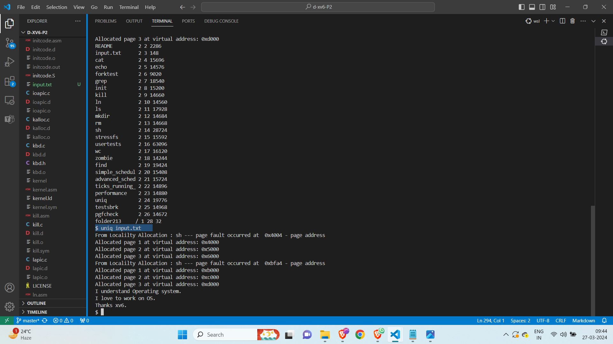

Siddhartha Reddy Guthikonda - U62740661
Chakradhar Reddy Nallu-U22128895
Deepthi Muttineni - U88032559 

> System Requirements and additional packages

- OS: Ubuntu 22.04 LTS
- Processor: i7

make clean:


make qem-nox:

# Part1
## Implementation of sbrk().
In sys_proc.c 
in function sys_sbrk() after commenting lines and incrementing the process memory by n size
```
  // if(growproc(n) < 0)
  //   return -1;
  myproc()->sz+=n; 
```

The commented section of code that actually allocates memory and increases the size of the process. Rather than allocating memory, we are simulating the behavior of sbrk() by directly manipulating the sz field of the proc structure.

## how page allocation is implemented in xv6 originally.

In xv6, the **growproc()** function in the **vm.c** file usually manages page allocation for processes.

* growproc() function allocates memory for a process when the size of the process's memory needs to increase. It first determines how many pages are required to support the requested size increase before allocating those pages.The kalloc() function, which allocates physical memory pages, is used inside growproc() to allocate pages. The address space of the process is then mapped to these pages.
growproc() maps the pages into the address space of the process after they have been allocated. In order to incorporate mappings for the recently assigned pages, the page tables must be updated.
Lastly, growproc() modifies the proc structure's sz field to account for the larger process address space.

* allocuvm()
This function is called by sbrk() where allocuvm() allocates  new pages, adds mapping into page table for new pages. allocuvm grows va mem old size to new size once it grown. switchuvm() is called multiple times to update the cr3 register and TLB.

* mappages()
Generally mappages works to map a range of virtual address to range physical address. In page table it walks through everypage and translates the virtual address to physical address and get a pointer to page table entry(PTE) via walkpgdir().

* walkpgdir()
It fills with physical address and permissions. It generally walks into pagetable and returns PTE of virtual address. For page index pds into the page directory locates the inner pagetable and sets the inner page table entry. 
If any inner page table is not present it can allocate page table byy calling kalloc()

* kalloc()
This function works like anyone who needs free page calls kalloc(). It sets free pages list pointer to next page and returns first free page on list. 


## System breaks when sbrk() is rewritten. 
It results this output 


``` pid 3 sh: trap 14 err 6 on cpu 0 eip 0x1240 addr 0x4004--kill proc ```

* This error message indicates that PID 3  was involved in a trap, which is an exception or interrupt. When accessing memory address 0x4004, an error happened on CPU 0 at instruction pointer (eip) 0x1240. The error number(err) is 6. Finally, because of this error, the kernel kills the process (kill proc). The "Page Fault" error code 6 usually means that the process tried to access a memory address that wasn't mapped in its address space at the time. 

* When sbrk() is rewritten, the system may break due to errors such as memory corruption where, Accessing memory that has been freed up, memory that has been accessed outside of the designated region, or memory that has not been initialized could all be the cause of this. Errors related to improper memory management or mapping within the rewritten sbrk() function could raise this error. and also other errors such as infinite loops( system might hang or unresponsive ), invalid memory accesses(it can trigger segmentation faults), concurrency issues(if it is not synchronized properly it leads unpredictable behavior and system crashes), or broken dependencies on other functions.   


## Significance of sbrk() within xv6.

* In xv6 processes, dynamic memory allocation is enabled via sbrk(). 
* It eliminates the requirement for pre-allocation or fixed-size memory areas by enabling processes to dynamically request more memory from the operating system as needed.

* A process's heap portion of address space is managed by the RAM allocated by sbrk().
* The heap is a section of memory used for dynamic memory allocation, allowing memory blocks to be allocated and released at will while the application is running.
* sbrk()'s dynamic memory allocation is essential for enabling dynamic data structures like dynamic arrays, linked lists, and trees.
* Sbrk() enables the dynamic memory allocation and deallocation processes that these data structures require to be carried out during runtime.
* Processes can respond to changing memory requirements while running programs by allocating memory in an adaptable and efficient manner thanks to sbrk(). 
* By this memory utilization is optimized and unwanted memory waste is avoided.Sbrk() lets processes grow their address space dynamically to meet new memory requirements as they run and their memory requirements vary.Supporting processes with different patterns of memory utilization requires this flexibility. 
* Sbrk() is designed to handle dynamic memory allocation by memory allocation libraries like free() and malloc(), which are frequently used in user-space programs. These libraries extend sbrk()'s functionality to give higher-level memory management features.


# Part2

## Implementation of laze page allocation

```
How to run:

make clean
make qemu-nox ALLOCATOR=LAZY
```

In trap.c 

```
void
trap(struct trapframe *tf)
{
  
    .... REST OF CODE ....

    uint faulting_virtual_address = rcr2(); 
  

  switch(tf->trapno){
  case T_IRQ0 + IRQ_TIMER:
    if(cpuid() == 0){
      ......
    }

    .... 

  case T_PGFLT: 
        char *mem = kalloc();
        
        if(mem == 0)
                goto bad;

        memset(mem, 0, PGSIZE);
            
        faulting_virtual_address  = PGROUNDDOWN(faulting_virtual_address);
           
        cprintf("From Lazy Allocation : page fault occurred at 0x%x-page \n",faulting_virtual_address);
        
        if(mappages(myproc()->pgdir, (void*)faulting_virtual_address, PGSIZE, V2P(mem), PTE_W|PTE_U) < 0) {
                kfree(mem);
                goto bad;
            }
        return; 

            ... REST OF CODE ....

    bad:
    myproc()->killed = 1;
  }
}

```
Generally  allocuvm() allocates  new pages, adds mapping into page table for new pages. allocuvm grows va mem old size to new size.
As we are not using the implementation of growproc() in which the allocuvm() allocates the memory. 
This code handles page faults (T_PGFLT) by allocating physical memory using kalloc(), initializing it to zero with memset() , and mapping it to the faulting virtual address. It rounds down the faulting virtual address, prints a message indicating the occurrence of the page fault, and uses mappages() to establish the mapping between physical and virtual addresses with appropriate permissions.


## Execution of given commands using LAZY allocation.

Here we have executed various commands 
```
echo "Hello!" 
```


```
cat input.txt
```


```
wc input.txt
```


```
mkdir folder123

```


```
ls
```


execution works normally in all above commands and it results the 
page faults at addressess at 0x4000 and 0xb000


Also executed the with complex program commands uniq and find 
here we can see the smooth execution with expected page faults.

```
uniq input.txt
```


```
find . -name input.txt
```


Working in anyfolder


# Part 3
```
How to run:

make clean
make qemu-nox ALLOCATOR=LOCALITY
```

<u> Locality-Aware  allocator</u>


1. Makefile and code correctly modified to support the selecet


## Implemenation of LOCALITY-AWARE ALLOCATION


<b>In Makefile </b>

<b><u>In trap.c </u></b>

```
void
trap(struct trapframe *tf)
{

   int con_pages=3;

  .........

  uint faulting_virtual_address = rcr2();  

  switch(tf->trapno){
      case 1:

      .....   REST OF CODE .....

      case T_PGFLT: 
        uint start_addr = PGROUNDDOWN(faulting_virtual_address);
      
        cprintf("From Localilty Allocation : page fault occurred at 0x%x - page address\n",faulting_virtual_address);

        for (int i = 0; i < con_pages; i++) 
          {

          
           char *mem = kalloc();
          if (mem == 0)
            goto bad;
          
          memset(mem, 0, PGSIZE);


          uint faulting_virtual_address_aligned = start_addr + i * PGSIZE;

          if (mappages(myproc()->pgdir, (void *)faulting_virtual_address_aligned, PGSIZE, V2P(mem), PTE_W | PTE_U) < 0) {
            kfree(mem);
            goto bad;
        }

    }
            
  return;


  //PAGEBREAK: 13
  default:
    .............

  bad:
    myproc()->killed = 1;

  ..... REST OF CODE .......

      }
  }


```


This code implements a form of lazy allocation by allocating and mapping multiple consecutive pages upon encountering a page fault. It iterates over the 3 consecutive pages starting from the faulting address, allocates physical memory using kalloc(), initializes it to zero, and maps it to the corresponding virtual address using mappages(). This approach reduces the overhead of handling individual page faults by batching the allocation and mapping process for improved efficiency.
Here handling the multiple page faults at a time.


<b><u>Executing the given commands using LOCATLITY ALLOCATION </u></b>
```
echo "Hello!"
```


```
cat input.txt
```


```
wc input.txt
```


```
mkdir folder123
```


 
```
ls
```


```
uniq input.txt
```




```
 find . -name input.txt
```


Working in any folder 


# Part 4


Breif explanation of LAZY and LOCALITY-AWARE allocations

<b> LAZY Allocation </b> 


Similar to allocuvm memory allocation and mapping can seen with this code.
Here the faulting virtual address is stored in a variable 
Here the pagefault trap  ```case: T_PGFLT``` is handled in the switch case 
allocating the new page of physical memory using kalloc(). 
Initializing the newly allocated physical address with 0.
The faulting_virtual_address is round down using ```PGROUNDDOWN()``` function.

Printing the message which indicates that at specified virtual address a page fault is occured this helps to understand the context of the page fault.
by using the ``` mappages() ```function call here it maps the physical and virtual addresses with parameters include page directory, faulting virtual address, pgsize, and the flags PTE_W | PTE_U which indicates the page table entry flags to allow wirting and user access.


<b>LOCALITY-AWARE allocation </b>

In this code it is same like previous allocation but here we are iterating the memory allocation for os to map 3 or more consequtive pages at each page fault which means that allocating the address for the page of the faulting address and the other subsequent pages at a time.
For this we have declared the count of the subsequent pages in variable int con_pages, and the faulting virtual address is stored in a variable 
After encountering the pagefault trap  ``` case: T_PGFL ``` which is handled in the switch case. 
Here the  from the start_address the code iterates over the con_pages 
it starts allocating the new pages of physical memory using kalloc(). 

Initializing the newly allocated physical address with 0 using memset(). The faulting_virtual_address is round down using``` PGROUNDDOWN() ```function.

Printing the message which indicates that at specified virtual address a page fault is occured this helps to understand the context of the page fault.
by using the ```mappages() ```function call here it maps the physical and virtual addresses with parameters include page directory, faulting virtual address, pgsize, and the flags ```PTE_W | PTE_U``` which indicates the page table entry flags to allow wirting and user access.


# Allocations Implementation

explaination of lazy allocation implementation appropriate reference to the code

While executing the commands for different allocators
I have used the these print statements 

<u>In lazy allocation </u>
```
example:
          echo "Operating Systems 1!"

output:  From Lazy Allocation : page fault occurred at 0x4000 page
         From Lazy Allocation : page fault occurred at 0xb000 page
         Operating Systems 1!"

```

<u>In Locality allocation</u>

```
example:
          echo "Operating Systems 2!"

output:    From Localilty Allocation : sh --- page fault occurred at  0x4004 - page address
            Allocated page 1 at virtual address: 0x4000
            Allocated page 2 at virtual address: 0x5000
            Allocated page 3 at virtual address: 0x6000
            From Localilty Allocation : sh --- page fault occurred at  0xbfa4 - page address
            Allocated page 1 at virtual address: 0xb000
            Allocated page 2 at virtual address: 0xc000
            Allocated page 3 at virtual address: 0xd000
            "Operating Systems 2!"
```


<u>In pgfcheck.c </u>

```

#include "types.h"
#include "user.h"

#define PAGE_SIZE 4096  // Assume page size is 4KB in xv6

int main(void) {
    int *p1;
    int i;
    p1= (int*)sbrk(PAGE_SIZE);  // allocation of one page

    if ((int)p1 == -1) {
        printf(1,"sbrk() failed to allocate the memory\n");
        exit();
    }

    for (i = 0; i < 8*PAGE_SIZE / sizeof(int); i++) {
        p1[i] = i;
    }
    for (i = 0; i < PAGE_SIZE / sizeof(int); i++) {
        printf(1,"%d ", p1[i]);
    }
    printf(1,"\n");

    exit();
}

```

This program, ``` pgfcheck.c ```, requests one page (4KB) of memory by allocating memory using sbrk().
and after that, it inserts numbers into the memory-allocation region. It reads and prints the integers from the designated memory region after writing. Since the pages that sbrk() allocated are initially not in memory, this process will produce page faults. It will also print the output of n numbers in the given range. 


The results of both allocators while executing this program ```pgfcheck.c```

```
Using LAZY Allocation: 
command: pgfcheck
```


From the output of the userprogram ``` pgfcheck.c ```  we can see that the program generates multiple pages faults approximately 10 page faults are occurred at consequtive address. and also the program terminates with proper output


```
Using LOCALITY Allocation: 
command: pgfcheck
```


From the output of the userprogram ``` pgfcheck.c ```  we can see that the program generates multiple pages faults, but here the pagefauls of previous type of allocation are quite more than the LOCALITY-Aware allocation, which means that this type of allocation handles the pagefaults reduces the pagefault count by allocating 3 subsequent pages for every new page faults encounter. It prints the information about where the three page are allocated at virtual addresses.
This limits the pagefault count than previous execution approximately 3 page faults(previous allocation pagefaults are 8(excluding sh page faults)) are occurred at various address, and also the program terminates with proper output.


Here the pure LAZY Allocation implementation is with poor perfromance than Locality-aware and also it takes more overhead costs for every new page that is accessed.
Which means that this LOCALITY-Aware allocation works efficiently and providing better memory allocation with pages because it maps 3 pages at each page fault (including 2 subsequent pages with faulting address).


### CHANGES IN MAKE FILE

```
ifndef ALLOCATOR
ALLOCATOR=LAZY
endif


```


PART 4


Task 1


lseek Implementation


lseek is a syscall that changes the offset value to a certain region
if the offset is greater than the filesize, we just fill the holes in the file with NULL bytes, this needs to be done in the open syscall in order to work


Task 2

sys_link implementation

A systemlink is a link that doesnt really exit it can point to another file, the file doesnt have to exit for that. 

Implementation: 

to implement the synlink systemcall we just allocate a new file with the Type T_Synlink and write the target path to the inode. 

open() needs to notice that this is a specail file and just reads the content out of our special inode with the type T_SYNLINK which is the path to the real file If the 2 paths match Open allocates a new fileDescriptor and returns it, if not it still returns -2


